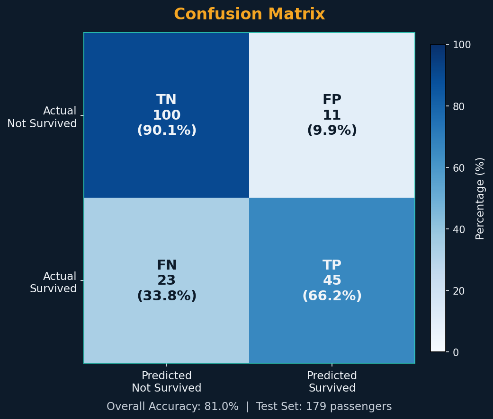
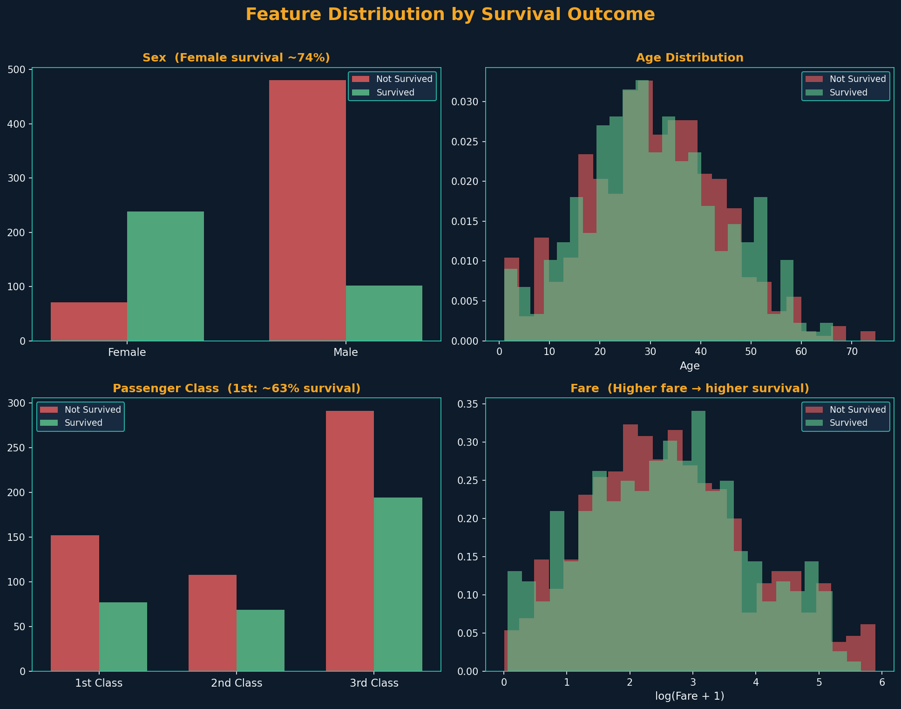
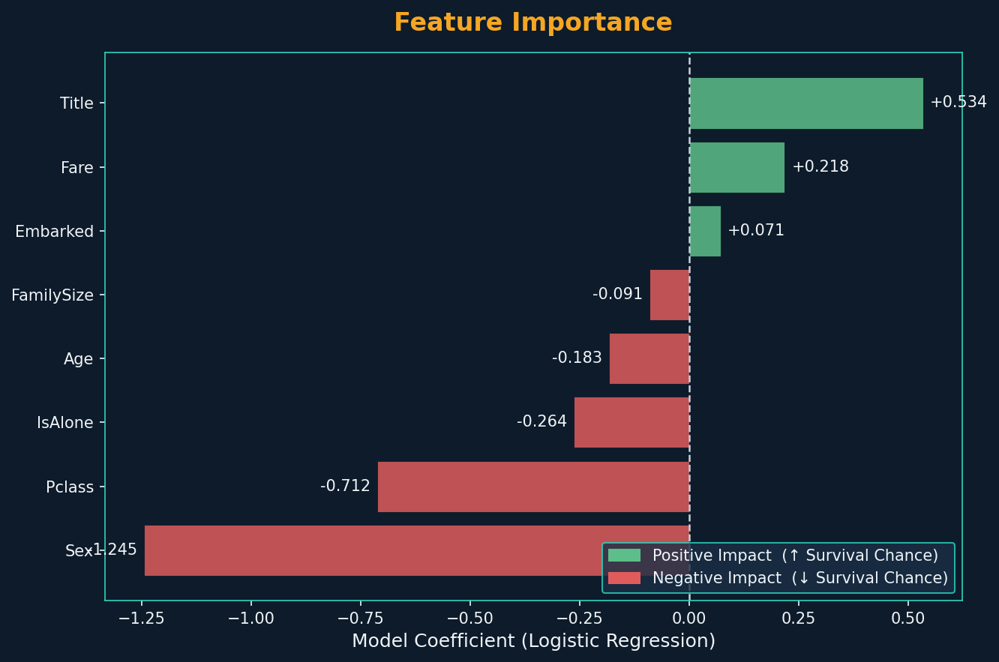

# 🚢 Titanic Survival Prediction


A machine learning project that predicts whether a Titanic passenger survived using engineered features and a Logistic Regression classifier.

## Table of Contents

- [Problem Statement](#problem-statement)
- [Project Overview](#project-overview)
- [Business Use Case](#business-use-case)
- [Results at a Glance / Model Performance](#results-at-a-glance--model-performance)
- [Results and Key Findings](#results-and-key-findings)
- [Visual Results](#visual-results)
  - [Confusion Matrix](#confusion-matrix)
  - [ROC Curve](#roc-curve)
  - [Feature Distribution](#feature-distribution)
  - [Feature Importance](#feature-importance)
- [Tech Stack](#tech-stack)
- [Project Structure](#project-structure)
- [How to Run](#how-to-run)
- [ML Pipeline - Step by Step](#ml-pipeline---step-by-step)
- [Selected Features Used](#selected-features-used)
- [Key Learnings / Findings](#key-learnings--findings)
- [Full Report](#full-report)
- [Connect](#connect)
- [License](#license)

## Problem Statement

Given passenger attributes (class, sex, age, fare, embarkation port, family context, and title), predict survival outcome (`Survived`: 0 or 1) for the Titanic disaster dataset.

## Project Overview

This project builds an end-to-end ML workflow: data loading, preprocessing, feature engineering, model training, evaluation, and result visualization. The main script (`titanic_model.py`) generates performance charts used in this documentation.

## Business Use Case

Although based on a historical dataset, this solution mirrors real-world binary classification use cases such as:

- customer churn prediction,
- loan default risk estimation,
- patient risk triage,
- fraud/non-fraud screening.

It demonstrates how interpretable models can support decision-making when feature transparency is important.

## Results at a Glance / Model Performance

From the included model outputs/visual artifacts:

- **Accuracy:** ~**81%**
- **ROC-AUC:** ~**0.86**
- **Confusion Matrix Counts:** TN=100, FP=11, FN=23, TP=45

## Results and Key Findings

- **Sex** is one of the strongest predictive signals for survival.
- **Passenger class (`Pclass`)** and **fare** capture socioeconomic survival differences.
- **Family context** (`FamilySize`, `IsAlone`) improves prediction quality beyond raw demographics.
- **Title extraction from names** contributes additional social-role signal.
- Logistic Regression provides a solid baseline with clear coefficient-level interpretability.

## Visual Results

### Confusion Matrix



### ROC Curve


### Feature Distribution



### Feature Importance



## Tech Stack

- **Language:** Python 3.10+
- **Data & Modeling:** pandas, numpy, scikit-learn
- **Visualization:** matplotlib
- **App/Exploration:** streamlit
- **Testing:** pytest
- **Linting/Quality:** flake8, pylint

## Project Structure

```text
titanic-survival-prediction/
├── titanic_model.py
├── requirements.txt
├── environment.yml
├── README.md
├── Titanic Survival prediction final.pdf
├── banner-3.png
├── confusion_matrix-9.png
├── roc_curve-15.png
├── feature_distribution-5.png
├── feature_importance-2.png
├── outputs/
│   ├── README.md
│   ├── confusion_matrix.png
│   ├── roc_curve.png
│   └── feature_distribution.png
└── tests/
    └── test_project_files.py
```

## How to Run

### Option 1: pip

```bash
python -m venv .venv
source .venv/bin/activate  # Windows: .venv\\Scripts\\activate
pip install -r requirements.txt
python titanic_model.py
```

### Option 2: conda

```bash
conda env create -f environment.yml
conda activate titanic-survival-prediction
python titanic_model.py
```

> `titanic_model.py` expects `train.csv` in the project root.

## ML Pipeline - Step by Step

1. **Load data** (`train.csv`) with pandas.
2. **Inspect data quality** (shape, missing values, base survival rate).
3. **Feature engineering**:
   - extract `Title` from `Name`,
   - create `FamilySize`,
   - create `IsAlone`.
4. **Impute missing values** for `Age`, `Embarked`, and `Fare`.
5. **Encode categoricals** (`Sex`, `Embarked`, `Title`).
6. **Select model features** and target (`Survived`).
7. **Train/test split** with stratification.
8. **Scale features** using `StandardScaler`.
9. **Train model** with `LogisticRegression`.
10. **Evaluate** via Accuracy, ROC-AUC, classification report, confusion matrix.
11. **Visualize** confusion matrix, ROC curve, feature distribution, and feature importance.

## Selected Features Used

- `Pclass`: Passenger class (1/2/3)
- `Sex`: Encoded gender (0=male, 1=female)
- `Age`: Passenger age
- `Fare`: Ticket fare
- `Embarked`: Port of embarkation (encoded)
- `FamilySize`: `SibSp + Parch + 1`
- `IsAlone`: 1 if traveling alone, else 0
- `Title`: Name-derived title group (encoded)

## Key Learnings / Findings

- Basic domain-informed feature engineering can materially improve a classic baseline model.
- Interpretable linear models are useful for explaining outcome drivers.
- Visual diagnostics (ROC + confusion matrix + feature-level charts) make model behavior easier to communicate.

## Full Report

- [Titanic Survival Prediction Final Report (PDF)](Titanic%20Survival%20prediction%20final.pdf)

## Connect

- **GitHub (Author):** [@jameskoero](https://github.com/jameskoero)
- **Project Repository:** [titanic-survival-prediction](https://github.com/jameskoero/titanic-survival-prediction)
- **Questions/Feedback:** Open an issue in this repository

## License

No explicit `LICENSE` file is currently present in this repository. Add one if you want to define formal open-source usage terms.
