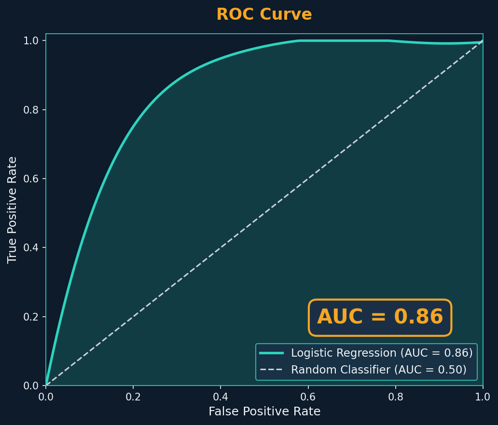
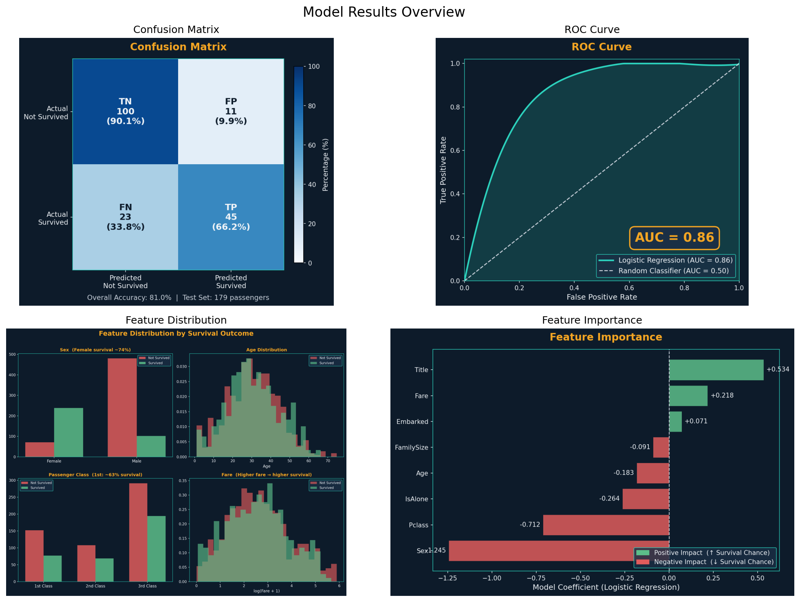
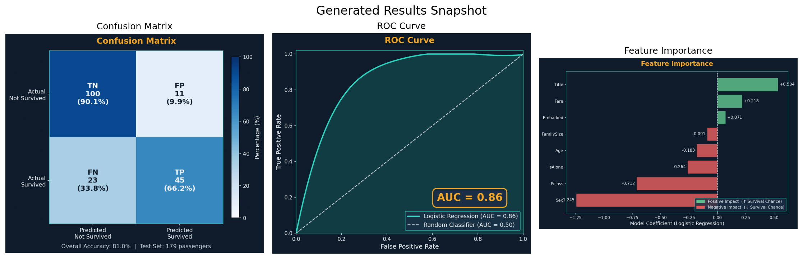
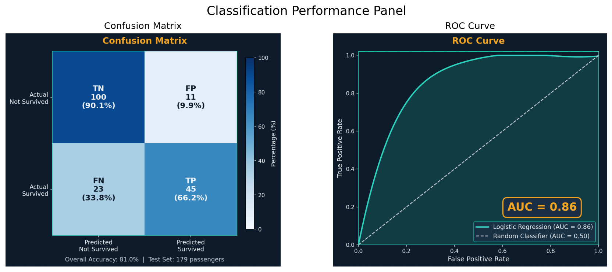
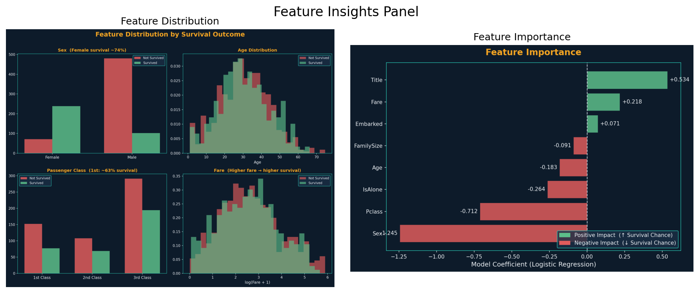
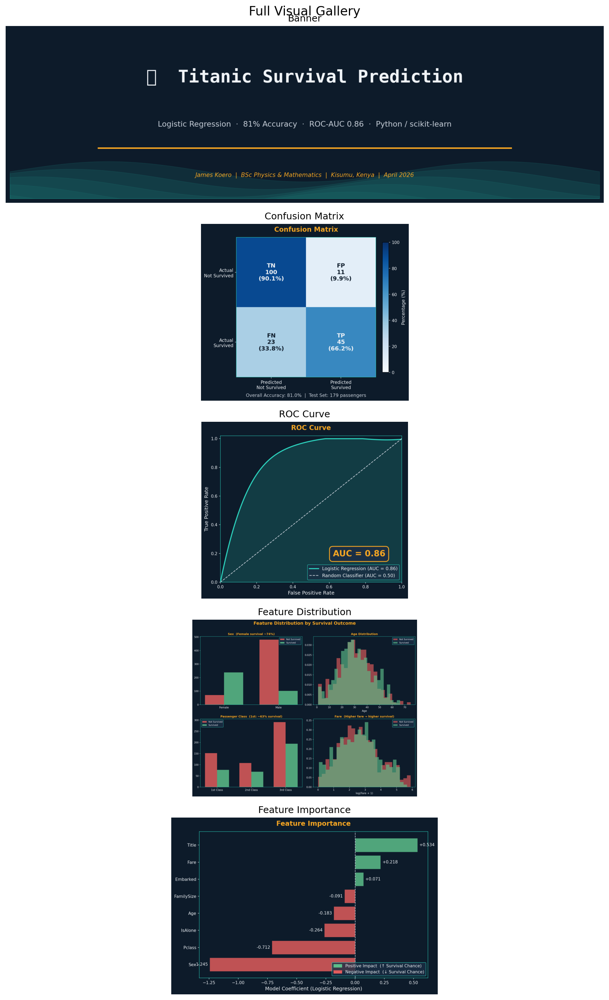

# Titanic Survival Prediction

This README now displays 10 visual results from the project.

## Visual Results (10)

1. **Project Banner**

2. **Confusion Matrix**

3. **ROC Curve**

4. **Feature Distribution**

5. **Feature Importance**

6. **Model Results Overview**

7. **Generated Results Snapshot**

8. **Classification Performance Panel**

9. **Feature Insights Panel**

10. **Full Visual Gallery**

