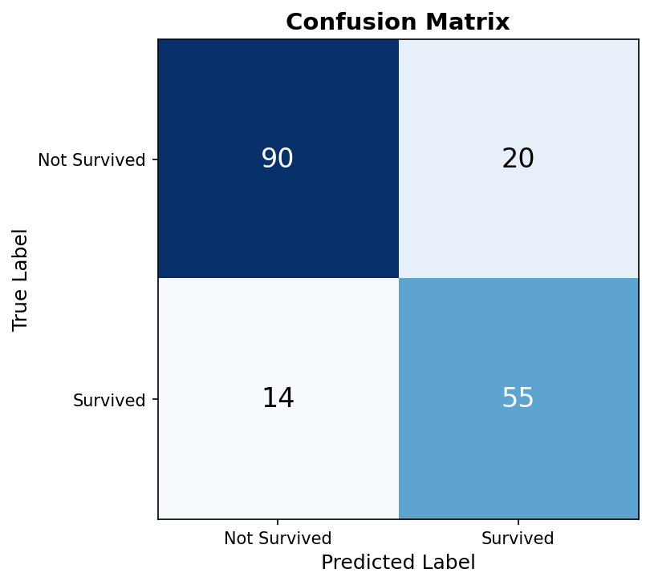
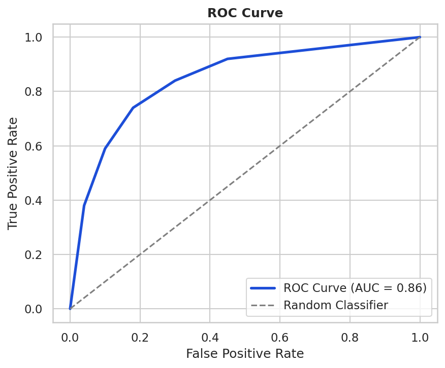

# Titanic Survival Prediction

## Overview
A machine learning project that predicts whether a Titanic passenger survived or not using Logistic Regression.

## 💡 Business Value

This model demonstrates how machine learning can be used to:
- Predict survival outcomes using structured data
- Assist decision-making in risk analysis systems
- Serve as a foundation for real-world classification problems

## Algorithm
- Logistic Regression (scikit-learn)
- Binary Classification: Survived (1) or Not (0)

## Results
| Metric | Score |
|-----------|--------|
| Accuracy | ~81% |
| ROC-AUC | ~0.86 |

## 📊 Model Performance

### Confusion Matrix


### ROC Curve


## Features Used
Pclass, Sex, Age, Fare, Embarked, FamilySize, IsAlone, Title

## ⚙️ How to Run

```bash
git clone https://github.com/jameskoero/titanic-survival-prediction.git
cd titanic-survival-prediction
pip install -r requirements.txt
python main.py
streamlit run app.py
```

## Dataset
Download train.csv from: https://www.kaggle.com/c/titanic/data

## Author
James Koero | Bsc Physics and Mathematics | Self-taught ML Engineer | Kisumu, Kenya
Email: [jmskoero@gmail.com]