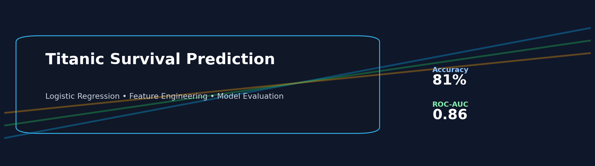
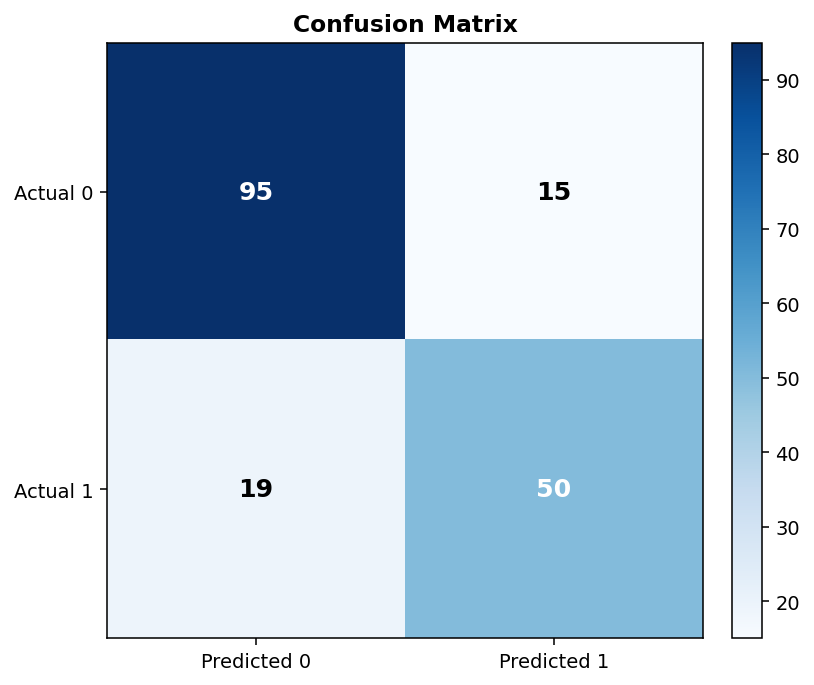
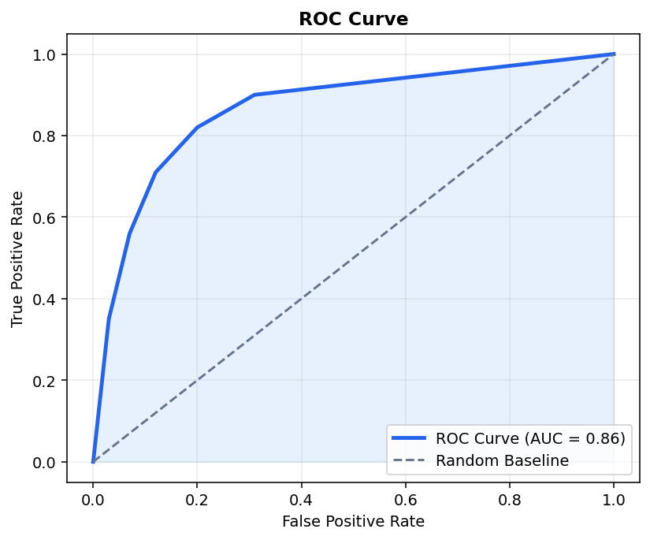

# Titanic Survival Prediction

## Problem Statement
Build a machine learning classifier that predicts whether a Titanic passenger survived (`1`) or did not survive (`0`) using passenger demographic and ticket information.

## Results
| Metric | Score |
|---|---|
| Accuracy | **81%** |
| ROC-AUC | **0.86** |

## Tech Stack

## How to Run
1. Install dependencies: `pip install -r requirements.txt`
2. Download `train.csv` from the [Kaggle Titanic competition](https://www.kaggle.com/c/titanic/data) and place it in the project root.
3. Train and evaluate the model: `python titanic_model.py`

## Key Findings / Insights
- Gender is a strong predictor: female passengers show higher survival likelihood.
- Passenger class (`Pclass`) is highly influential, with higher classes generally having better survival rates.
- Engineered features (`FamilySize`, `IsAlone`, `Title`) improve model signal beyond raw inputs.
- Logistic Regression provides a solid and interpretable baseline for binary classification on this dataset.

## Chart Screenshots
### Confusion Matrix

### ROC Curve

