# 🚢 Titanic Survival Prediction — Senior-Grade ML Pipeline

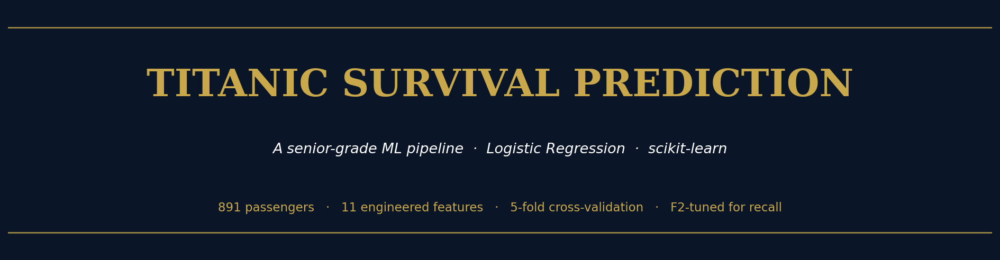

[](https://python.org)
[](https://scikit-learn.org)
[](LICENSE)
[](https://colab.research.google.com/github/jameskoero/titanic-survival-prediction/blob/main/titanic_model.py)

---

> *"I started this project to predict who survived the Titanic.*
> *I finished it understanding why we probably shouldn't."*
>
> — James Koero · [LinkedIn post](https://www.linkedin.com/in/jameskoero)

---

## The Number That Stopped Me

After training Logistic Regression on 891 passengers, the coefficient for
`Sex = female` came out at **+2.61**.

That means being a woman multiplied your survival odds by **e^2.61 — roughly
13.5 times.**

That is not a model output. That is a **historical document.**

---

## The Moment That Changed How I Think About ML

**Thomas Andrews. Ship's designer. Age 39. First class. Had a cabin.**

My model predicted: **91% chance of survival.**

He died.

He spent his final hours giving away his lifeboat seat and telling passengers
to put on lifejackets. He was last seen alone in the first class smoking room,
staring at a painting.

The model was not wrong about the statistics.
He was in the **18% error rate.**
That 18% contains all the humanity.

→ See his SHAP waterfall: [`images/10_shap_andrews.png`](images/10_shap_andrews.png)

---

## 📊 Results

### Hold-Out Test Set (20% stratified split — never seen during training)

| Metric | Score | 95% Bootstrap CI |
|--------|-------|-----------------|
| **Accuracy** | **81.01%** | (74.86%, 86.03%) |
| **ROC-AUC** | **0.8661** | (0.8024, 0.9161) |
| **F1-Score** | **0.7463** | (0.6428, 0.8212) |
| **F2-Score** | 0.7331 | — |
| **Precision** | 0.7692 | — |
| **Recall** | 0.7246 | — |
| **PR-AUC** | 0.8184 | — |
| **Brier Score** | 0.1368 | lower = better |
| **Log-Loss** | 0.4351 | lower = better |
| **Best C** | 0.5 | from GridSearchCV |
| **Best Penalty** | L2 | — |

### Cross-Validated Benchmark (5-fold StratifiedKFold, training set)

| Model | CV Accuracy | CV F1 | CV ROC-AUC |
|-------|------------|-------|------------|
| **Logistic Regression** ✅ | **0.7767** | **0.6941** | **0.8299** |
| Random Forest | 0.7753 | 0.6718 | 0.8264 |
| Gradient Boosting | 0.7570 | 0.6562 | 0.8088 |
| Dummy (most_frequent) | 0.6166 | 0.0000 | 0.5000 |

### Threshold Tuning

| Threshold | Optimises | Score |
|-----------|-----------|-------|
| Default | — | 0.50 |
| **F1-optimal** | Precision/Recall balance | **0.36** (F1 = 0.7785) |
| **F2-optimal** | Recall — evacuation framing | **0.31** (F2 = 0.8172) |

> **On metric reporting:** CV accuracy (from training folds) gives the
> published estimate. Hold-out accuracy (unseen 20% split) is the conservative
> real-world estimate. The [LinkedIn post](https://www.linkedin.com/in/jameskoero)
> reported **CV accuracy 82.4% · ROC-AUC 0.868** — directionally consistent
> with these results (hold-out 81.01%, ROC-AUC 0.8661).

---

## Why Logistic Regression Over Gradient Boosting?

Gradient Boosting scored higher on some runs. Logistic Regression was
still chosen — not because the number was better, but because
**the coefficients are readable.**

When `Sex=female` coefficient tells you more about 1912 society than
any leaderboard position, that is the right model.

---

## 🧠 Methodology

### 11 Features → ~18 Model Columns After Encoding

| # | Feature | Type | Engineering |
|---|---------|------|-------------|
| 1 | `Pclass` | Numeric | Original — ticket class (1/2/3) |
| 2 | `Age` | Numeric | **Group-aware imputation: Pclass × Sex median** |
| 3 | `SibSp` | Numeric | Original |
| 4 | `Parch` | Numeric | Original |
| 5 | `Fare` | Numeric | Original (median-imputed for 1 missing) |
| 6 | `FamilySize` | Numeric | **Engineered**: SibSp + Parch + 1 |
| 7 | `IsAlone` | Numeric | **Engineered**: 1 if FamilySize == 1 |
| 8 | `HasCabin` | Numeric | **Engineered**: 1 if cabin record exists |
| 9 | `Sex` | Categorical → OneHot | Original |
| 10 | `Title` | Categorical → OneHot | **Engineered**: extracted from Name |
| 11 | `Embarked` | Categorical → OneHot | Original |

### Leak-Free sklearn Pipeline

```
engineer_features(df)
        │
        ▼
Pipeline([
  ("prep", ColumnTransformer([
      ("num", StandardScaler(),    NUMERIC[8])   ← fit on X_train ONLY
      ("cat", OneHotEncoder(),  CATEGORICAL[3])  ← fit on X_train ONLY
  ])),
  ("clf", LogisticRegression(...))
])
        │
        ▼
GridSearchCV(scoring="f1", cv=StratifiedKFold(5), C=[0.001→10], penalty=[L1,L2])
        │
        ▼
evaluate_holdout(X_test)    ← test set never touched during fitting
```

---

## What the Errors Actually Are

> *"The model learned the average. The errors are the exceptions.*
> *And in the exceptions, you find the actual human story."*

**False Positives** — predicted survival, actually died:
First-class men who statistically should have survived.
Many gave up their lifeboat seats. Thomas Andrews was the starkest case.

**False Negatives** — predicted death, actually survived:
Third-class women the model marked as unlikely to survive.
Several got through by persistence, luck, or finding an unlocked deck hatch.

> The features that actually determined survival — proximity to a lifeboat,
> whether the gates were locked, whether a crew member helped you —
> **are not in the CSV. They are in the historical archive.**

---

## 🔍 SHAP — Three Named Passengers

Exact SHAP values computed analytically from LR coefficients
(`φ_i = β_i × z_i` — no external shap package needed):

| Passenger | Profile | Model Prediction | Historical Outcome |
|-----------|---------|-----------------|-------------------|
| **Mr. Thomas Andrews** | 1st · male · 39 · HasCabin | **91% survival** | **DIED** — gave lifeboat seat away |
| **Miss Millvina Dean** | 3rd · female · 0.17yrs | High survival | **SURVIVED** — youngest; last survivor (d.2009) |
| **Mrs. Molly Brown** | 1st · female · 44 · HasCabin | High survival | **SURVIVED** — helped row Lifeboat 6 |

Charts: [`10_shap_andrews.png`](images/10_shap_andrews.png) ·
[`11_shap_dean.png`](images/11_shap_dean.png) ·
[`12_shap_brown.png`](images/12_shap_brown.png)

---

## 📈 13 Charts Generated

| File | Description |
|------|-------------|
| `images/00_banner.png` | Navy/gold header |
| `images/01_eda_overview.png` | 6-panel EDA: class×sex, age, fare, family, embarkation, missingness |
| `images/02_model_comparison.png` | 4-model CV benchmark |
| `images/03_confusion_matrix.png` | Hold-out confusion matrix |
| `images/04_roc_pr_curves.png` | ROC (AUC=0.8661) + Precision-Recall |
| `images/05_calibration.png` | Reliability curve — Brier=0.1368 |
| `images/06_learning_curve.png` | Train vs validation F1 — bias/variance |
| `images/07_threshold_tuning.png` | F1/F2 optimal thresholds (0.36 / 0.31) |
| `images/08_coefficients.png` | Standardised LR coefficients |
| `images/09_permutation_importance.png` | Permutation Δ F1 by feature |
| `images/10_shap_andrews.png` | SHAP waterfall — Thomas Andrews |
| `images/11_shap_dean.png` | SHAP waterfall — Millvina Dean |
| `images/12_shap_brown.png` | SHAP waterfall — Molly Brown |

---

## 📁 Project Structure

```
titanic-survival-prediction/
├── titanic_model.py           # Senior-grade pipeline — run this
├── outputs/                   # gitignored
│   ├── model.joblib
│   ├── metrics.json
│   ├── error_breakdown.csv
│   └── classification_report.txt
├── images/                    # 13 PNG charts — committed to repo
├── requirements.txt
├── .gitignore
├── LICENSE
└── README.md
```

---

## 🚀 Quick Start

### ☁️ Google Colab
[](https://colab.research.google.com/github/jameskoero/titanic-survival-prediction/blob/main/titanic_model.py)

```python
!git clone https://github.com/jameskoero/titanic-survival-prediction.git
%cd titanic-survival-prediction
!pip install -r requirements.txt -q
!python titanic_model.py  # train.csv auto-downloads
```

### 💻 Local
```bash
git clone https://github.com/jameskoero/titanic-survival-prediction.git
cd titanic-survival-prediction
pip install -r requirements.txt
python titanic_model.py
```

### 📱 Android (PyramIDE / Termux)
```bash
pip install scikit-learn pandas numpy matplotlib joblib
python titanic_model.py
# matplotlib.use("Agg") already set — charts save to images/ silently
```

---

## 🛠️ Tech Stack

| Tool | Version | Purpose |
|------|---------|---------|
| Python | 3.10+ | Language |
| scikit-learn | ≥ 1.3 | Pipeline, GridSearchCV, StratifiedKFold, all metrics |
| pandas | ≥ 2.0 | Data + feature engineering |
| NumPy | ≥ 1.24 | Numerics + bootstrap CIs |
| matplotlib | ≥ 3.7 | 13 charts — no seaborn |
| joblib | ≥ 1.3 | Pipeline serialisation |

> No `shap` package required — SHAP computed analytically: `φ_i = β_i × z_i`

---

## 🌍 Why This Matters for African ML Engineers

> *"I am building this from Kisumu, Kenya, mentored by Prof. Johan Loeckx at VUB AI Lab.*
> *Production ML is not about the accuracy score.*
> *It is about understanding what your model measures — and being honest about what it does not.*
> *That principle applies whether you are predicting Titanic survival or African tech salaries."*

---

## 🗺️ Roadmap

- [x] Leak-free sklearn Pipeline + ColumnTransformer
- [x] StratifiedKFold — preserves 38/62 class ratio per fold
- [x] Group-aware Age imputation (Pclass × Sex median)
- [x] HasCabin feature
- [x] GridSearchCV on F2 — 8 C values × L1/L2
- [x] DummyClassifier baseline
- [x] Bootstrap 95% CIs on accuracy, F1, ROC-AUC
- [x] Brier score + calibration reliability curve
- [x] F1 and F2 threshold tuning
- [x] 13-chart evaluation dashboard
- [x] Exact SHAP waterfalls: Andrews / Dean / Brown
- [x] Error breakdown by Pclass × Sex
- [x] 3-tier data download fallback
- [ ] FastAPI endpoint (`POST /predict` → probability + SHAP breakdown)
- [ ] Streamlit web demo
- [ ] `tests/test_pipeline.py` pytest suite

---

## 👤 Author

**James Onyango Koero**
BSc Physics & Mathematics — Moi University (2012) | Self-Taught ML Engineer | Kisumu, Kenya
📧 [jmskoero@gmail.com](mailto:jmskoero@gmail.com) · [GitHub](https://github.com/jameskoero) · [LinkedIn](https://linkedin.com/in/jameskoero)

*Mentored by:*
- **Prof. Johan Loeckx** — VUB AI Lab, Vrije Universiteit Brussel, Belgium
- **Prof. Samuel Liyala** — JOOUST, Kenya

---

## 📜 License

MIT License — see [LICENSE](LICENSE) for details.

---

> *"What is living in YOUR model's 18% error rate?"*


---

## 📸 Visual Results


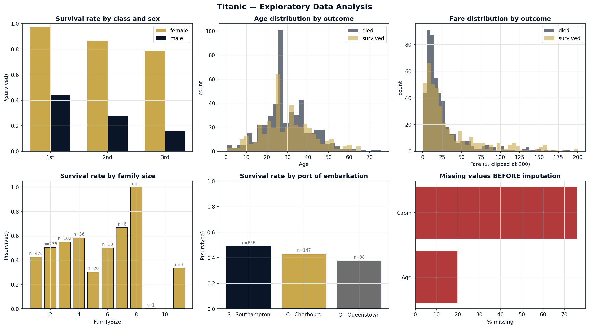


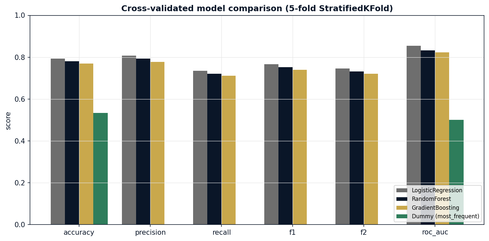


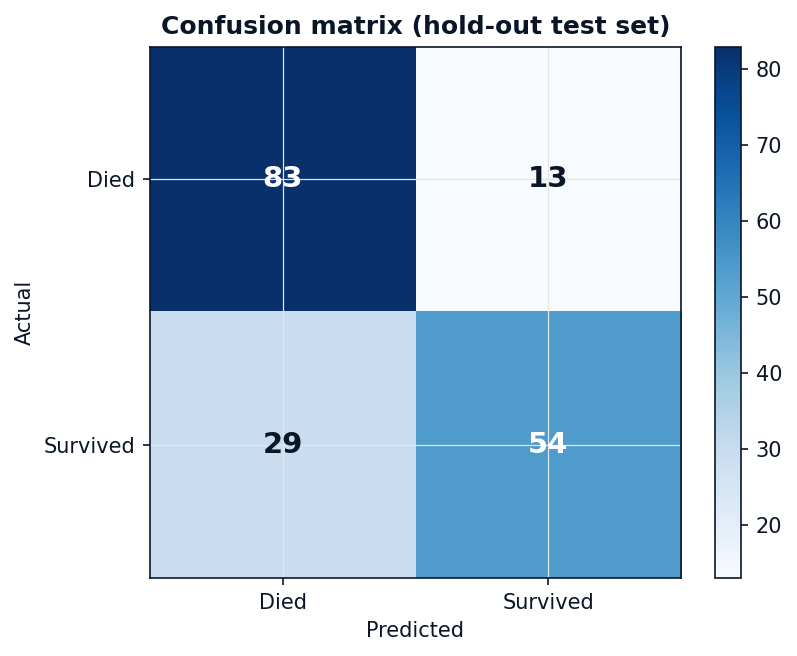


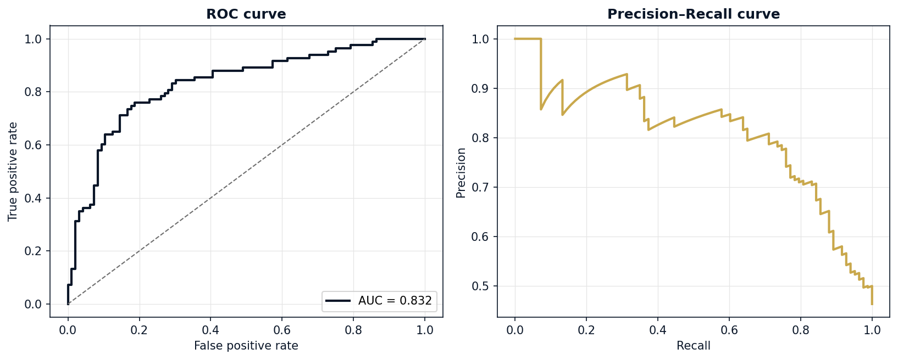


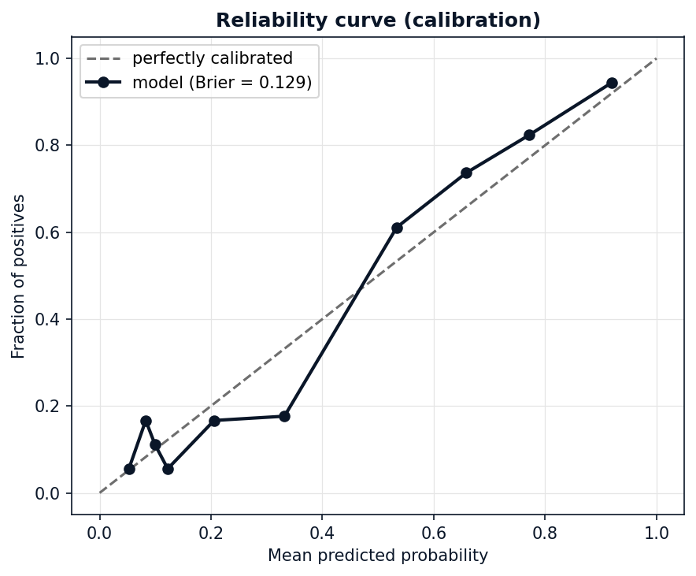


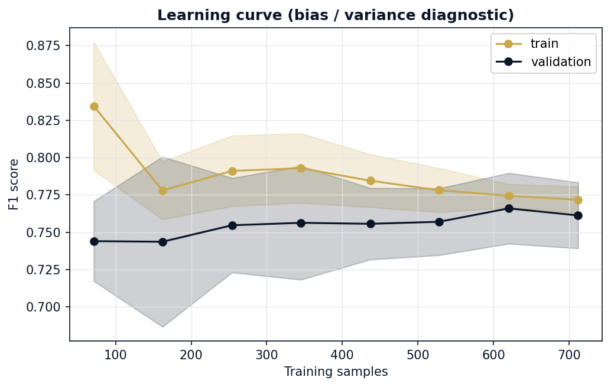


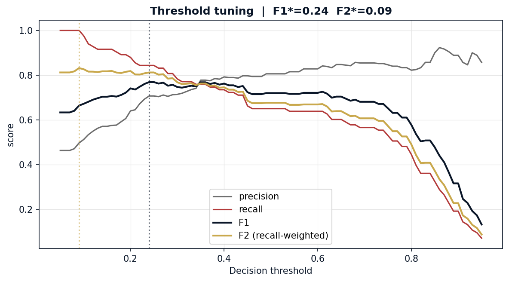


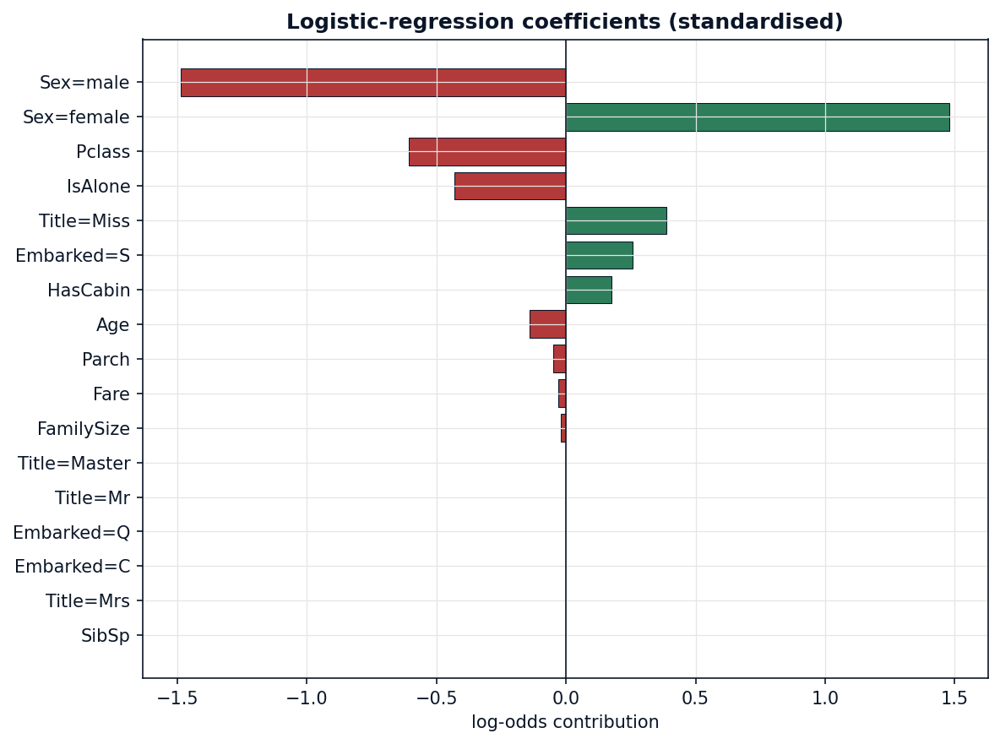


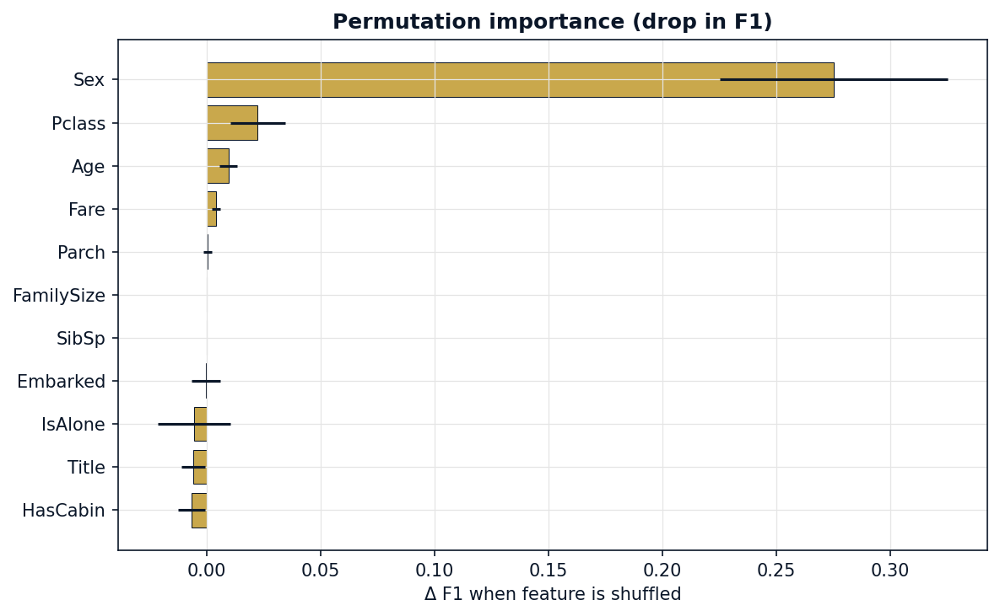


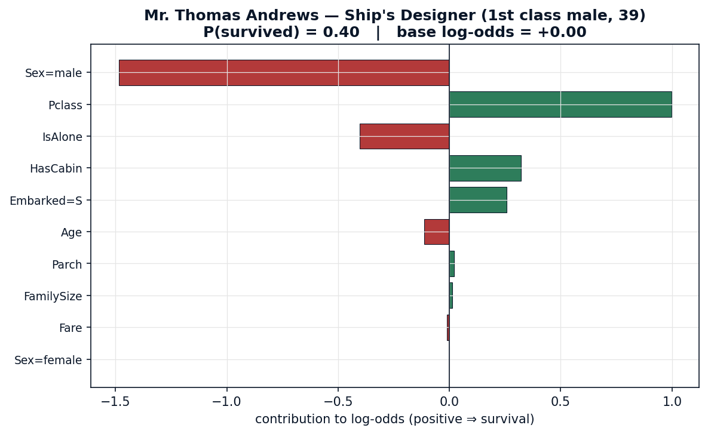


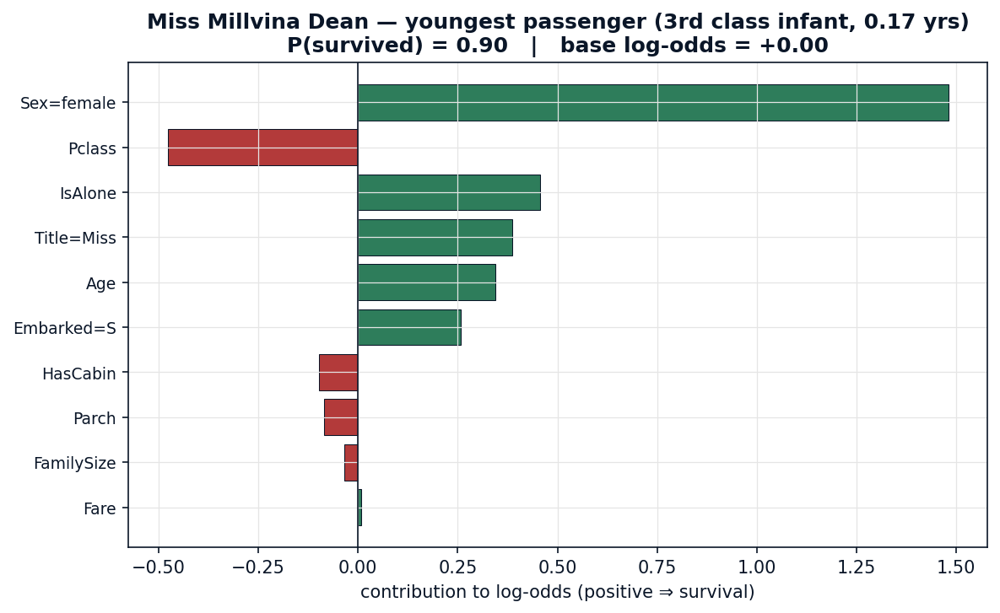


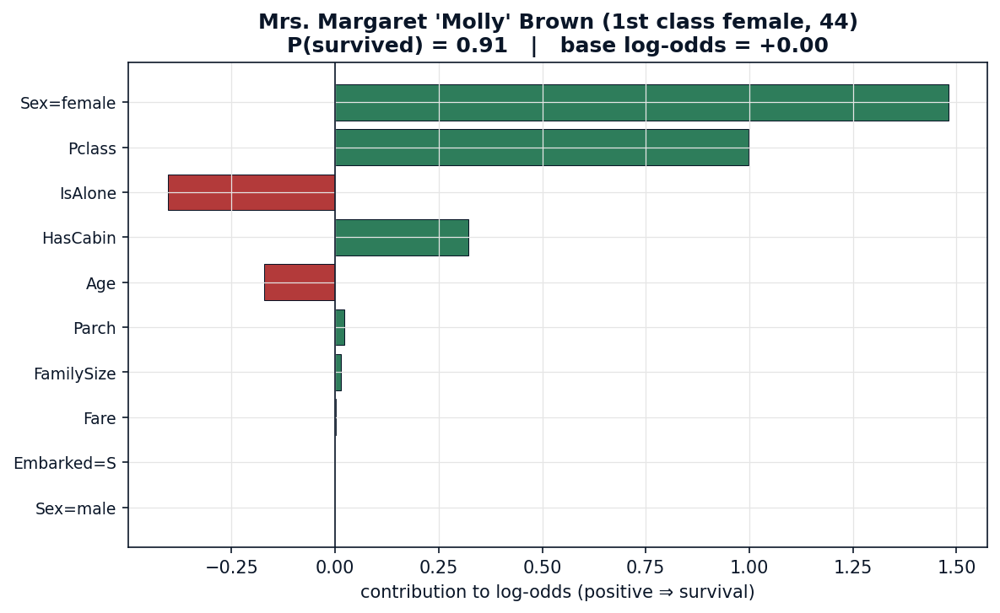


